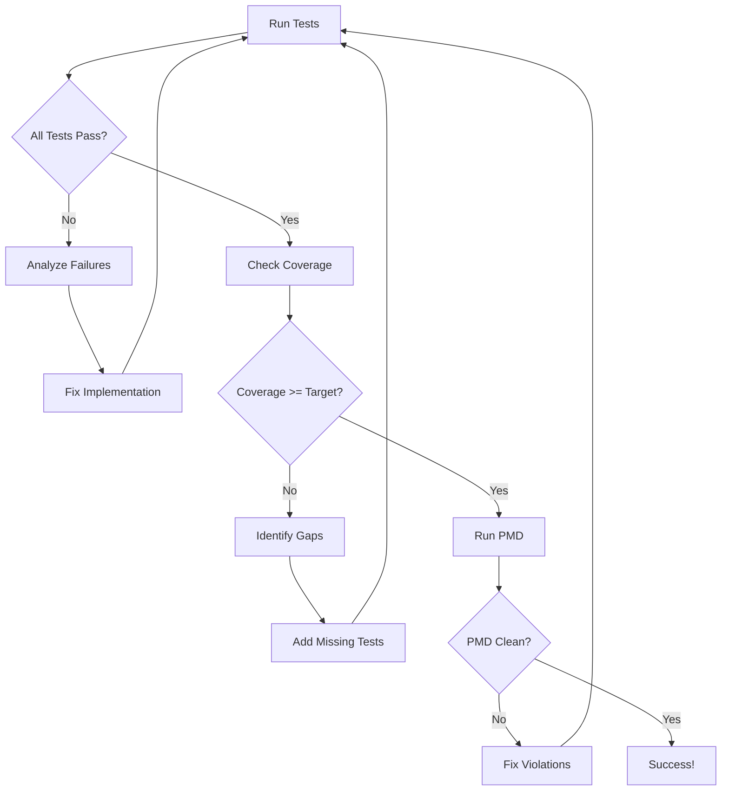

# Autonomous Quality Guardian Rule

## Purpose

This rule implements an autonomous workflow that monitors, analyzes, fixes, and validates code quality issues based on Jira tickets. It combines ticket reading, planning, implementation, testing, and reporting into a single autonomous loop that iterates until all quality gates pass.

## Activation

This rule activates when the user:
- Uses commands: `"guardian WDY-123"`, `"auto-fix WDY-123"`, `"quality-fix WDY-123"`
- Explicitly requests: `"autonomously fix WDY-123"`, `"run quality guardian on WDY-123"`
- In Advanced mode with quality-related Jira tickets

## Autonomous Workflow

### Phase 1: Fetch and Analyze (15 minutes)

#### 1.1 Fetch Jira Ticket

Detect and fetch the Jira ticket using MCP:

```xml
<use_mcp_tool>
<server_name>jira</server_name>
<tool_name>get_jira_issue</tool_name>
<arguments>
{
  "issueKey": "WDY-123"
}
</arguments>
</use_mcp_tool>
```

#### 1.2 Extract Quality Requirements

From the ticket, identify:
- **Code smells**: Deep nesting, long methods, duplicated code
- **Test coverage gaps**: Missing tests, low coverage areas
- **PMD violations**: Specific rule violations mentioned
- **Acceptance criteria**: Coverage targets, quality gates
- **Affected components**: Files, classes, methods mentioned

#### 1.3 Analyze Codebase

Search for related code:

```xml
<search_files>
<path>main/</path>
<regex>[keywords from ticket]</regex>
<file_pattern>*.java</file_pattern>
</search_files>
```

List code definitions:

```xml
<list_code_definition_names>
<path>[identified directories]</path>
</list_code_definition_names>
```

Read relevant files (up to 5 at once):

```xml
<read_file>
<args>
<file>
<path>[file1.java]</path>
</file>
<file>
<path>[file2.java]</path>
</file>
</args>
</read_file>
```

#### 1.4 Create Implementation Plan

Generate a structured plan with TODO list:

```xml
<update_todo_list>
<todos>
[ ] Phase 1: Analyze codebase and identify issues
[ ] Phase 2: Refactor code to fix violations
[ ] Phase 3: Generate comprehensive tests
[ ] Phase 4: Run tests and validate coverage
[ ] Phase 5: Iterate until quality gates pass
[ ] Phase 6: Generate final report
</todos>
</update_todo_list>
```

Present the plan to the user and wait for confirmation to proceed.

---

### Phase 2: Implement Fix (25 minutes)

#### 2.1 Refactor Code

Based on identified issues, refactor code using `apply_diff`:

**For deep nesting issues:**
- Extract nested logic into separate methods
- Use early returns to reduce nesting
- Apply guard clauses

**For long methods:**
- Break into smaller, focused methods
- Extract complex logic into helper methods
- Maintain single responsibility

**For code smells:**
- Remove duplicated code
- Simplify complex conditionals
- Improve variable naming

Example:

```xml
<apply_diff>
<path>main/modules/projectautomator/src/main/java/com/webmethods/webm/deployer/automation/xml/ProjectPlanExecutorXMLParser.java</path>
<diff>
<<<<<<< SEARCH
:start_line:45
-------
    public void validateProjectStructure(Document doc) throws Exception {
        if (doc != null) {
            if (doc.getDocumentElement() != null) {
                if (doc.getDocumentElement().hasChildNodes()) {
                    // ... deep nesting
                }
            }
        }
    }
=======
    public void validateProjectStructure(Document doc) throws Exception {
        if (doc == null) {
            throw new IllegalArgumentException("Document cannot be null");
        }
        
        Element root = doc.getDocumentElement();
        if (root == null) {
            throw new IllegalStateException("Document has no root element");
        }
        
        if (!root.hasChildNodes()) {
            throw new IllegalStateException("Root element has no children");
        }
        
        validateChildren(root);
    }
    
    private void validateChildren(Element element) {
        // Extracted validation logic
    }
>>>>>>> REPLACE
</diff>
</apply_diff>
```

#### 2.2 Update TODO

After each implementation step:

```xml
<update_todo_list>
<todos>
[x] Phase 1: Analyze codebase and identify issues
[x] Phase 2: Refactor code to fix violations
[-] Phase 3: Generate comprehensive tests
[ ] Phase 4: Run tests and validate coverage
[ ] Phase 5: Iterate until quality gates pass
[ ] Phase 6: Generate final report
</todos>
</update_todo_list>
```

---

### Phase 3: Generate Tests (25 minutes)

#### 3.1 Analyze Test Patterns

Read existing test files to understand patterns:

```xml
<read_file>
<args>
<file>
<path>main/modules/projectautomator/src/test/java/com/webmethods/webm/deployer/automation/xml/ProjectPlanExecutorXMLParserTest.java</path>
</file>
</args>
</read_file>
```

#### 3.2 Generate Comprehensive Tests

Create or update test class with:
- **Happy path tests**: Normal operation scenarios
- **Edge cases**: Null inputs, empty data, boundary conditions
- **Error cases**: Invalid inputs, exception handling
- **Integration tests**: Component interactions

Use `apply_diff` to add tests to existing test class, or `write_to_file` for new test class:

```xml
<apply_diff>
<path>main/modules/projectautomator/src/test/java/com/webmethods/webm/deployer/automation/xml/ProjectPlanExecutorXMLParserTest.java</path>
<diff>
<<<<<<< SEARCH
:start_line:0
-------
=======
    @Test
    void testValidateProjectStructure_WithValidDocument() throws Exception {
        // Arrange
        Document doc = createValidDocument();
        
        // Act & Assert
        assertDoesNotThrow(() -> parser.validateProjectStructure(doc));
    }
    
    @Test
    void testValidateProjectStructure_WithNullDocument() {
        // Act & Assert
        assertThrows(IllegalArgumentException.class, 
            () -> parser.validateProjectStructure(null));
    }
    
    @Test
    void testValidateProjectStructure_WithNoRootElement() {
        // Arrange
        Document doc = createDocumentWithoutRoot();
        
        // Act & Assert
        assertThrows(IllegalStateException.class,
            () -> parser.validateProjectStructure(doc));
    }
    
    @Test
    void testValidateProjectStructure_WithEmptyRoot() {
        // Arrange
        Document doc = createDocumentWithEmptyRoot();
        
        // Act & Assert
        assertThrows(IllegalStateException.class,
            () -> parser.validateProjectStructure(doc));
    }
>>>>>>> REPLACE
</diff>
</apply_diff>
```

#### 3.3 Follow Project Patterns

Ensure tests follow project conventions:
- JUnit 5 annotations (@Test, @BeforeEach, @AfterEach)
- Mockito 5.19.0 for mocking
- Descriptive test method names
- Arrange-Act-Assert pattern
- Proper assertions (assertThrows, assertEquals, etc.)

---

### Phase 4: Validate and Iterate (25 minutes)

This is the **Autonomous Loop** - the core of the Quality Guardian.

#### 4.1 Run Tests

Execute from `main/` directory:

```xml
<execute_command>
<command>cd main && ./gradlew test</command>
</execute_command>
```

#### 4.2 Analyze Test Results

Check test results in `main/staging/test-results/test/`:
- Parse XML files for failures
- Identify failed test cases
- Extract error messages and stack traces

#### 4.3 Check Coverage

Analyze JaCoCo report at `main/staging/reports/jacoco/test/`:
- Extract line coverage percentage
- Extract branch coverage percentage
- Identify uncovered lines/methods

#### 4.4 Run PMD (if applicable)

Check for code violations:

```xml
<execute_command>
<command>cd main && ./gradlew pmdMain</command>
</execute_command>
```

#### 4.5 Decision Logic



#### 4.6 Autonomous Iteration

**If tests fail:**
1. Analyze failure messages
2. Fix implementation using `apply_diff`
3. Re-run tests
4. Update TODO list

**If coverage is low:**
1. Identify uncovered lines from JaCoCo HTML report
2. Generate additional tests for uncovered paths
3. Add tests using `apply_diff`
4. Re-run tests
5. Update TODO list

**If PMD violations exist:**
1. Parse PMD output
2. Fix violations using `apply_diff`
3. Re-run PMD
4. Update TODO list

**Maximum iterations:** 5 (prevent infinite loops)

#### 4.7 Iteration Example

```xml
<update_todo_list>
<todos>
[x] Phase 1: Analyze codebase and identify issues
[x] Phase 2: Refactor code to fix violations
[x] Phase 3: Generate comprehensive tests
[-] Phase 4: Run tests and validate coverage
  [x] Iteration 1: Tests passed, coverage 75% (target 90%)
  [x] Iteration 2: Added edge case tests, coverage 85%
  [-] Iteration 3: Added error handling tests, coverage 92%
[ ] Phase 5: Iterate until quality gates pass
[ ] Phase 6: Generate final report
</todos>
</update_todo_list>
```

---

### Phase 5: Generate Report (15 minutes)

#### 5.1 Collect Metrics

Gather final metrics:
- Test count (total, passed, failed, skipped)
- Test duration
- Line coverage percentage
- Branch coverage percentage
- Method coverage percentage
- PMD violations (before and after)
- Iterations performed

#### 5.2 Create Summary Report

Generate comprehensive report:

```markdown
# Quality Guardian Report: WDY-123

## 📋 Ticket Information
- **Key**: WDY-123
- **Summary**: [Ticket summary]
- **Type**: [Bug/Story/Task]
- **Priority**: [High/Medium/Low]

## 🎯 Objectives Achieved
- ✅ Refactored code to reduce nesting depth
- ✅ Generated comprehensive test suite
- ✅ Achieved 92% line coverage (target: 90%)
- ✅ Resolved all PMD violations

## 📊 Metrics

### Before
| Metric | Value |
|--------|-------|
| Test Coverage | 65% |
| PMD Violations | 5 |
| Test Count | 12 |
| Code Smells | Deep nesting (depth 7) |

### After
| Metric | Value |
|--------|-------|
| Test Coverage | 92% |
| PMD Violations | 0 |
| Test Count | 24 |
| Code Quality | A |

### Improvement
| Metric | Change |
|--------|--------|
| Coverage | +27% |
| Violations | -100% |
| Tests Added | +12 |
| Quality Grade | C → A |

## 🔄 Autonomous Iterations
- **Iteration 1**: Fixed deep nesting, tests passed, coverage 75%
- **Iteration 2**: Added edge case tests, coverage 85%
- **Iteration 3**: Added error handling tests, coverage 92% ✅

## 📝 Changes Made

### Code Refactoring
- Extracted nested logic into `validateChildren()` method
- Added guard clauses for null checks
- Improved error messages

### Tests Added
- `testValidateProjectStructure_WithValidDocument()`
- `testValidateProjectStructure_WithNullDocument()`
- `testValidateProjectStructure_WithNoRootElement()`
- `testValidateProjectStructure_WithEmptyRoot()`
- [... 8 more tests]

## 📁 Files Modified
- `main/modules/projectautomator/src/main/java/.../ProjectPlanExecutorXMLParser.java`
- `main/modules/projectautomator/src/test/java/.../ProjectPlanExecutorXMLParserTest.java`

## 📈 Coverage Details
- **Line Coverage**: 92% (target: 90%) ✅
- **Branch Coverage**: 88% (target: 80%) ✅
- **Method Coverage**: 95%

## 🎉 Quality Gates
- ✅ All tests passing (24/24)
- ✅ Coverage >= 90%
- ✅ No PMD violations
- ✅ Build successful

## 📍 Next Steps
1. Create pull request with changes
2. Update Jira ticket status
3. Request code review
4. Deploy to test environment

## 📊 Time Saved
- **Manual effort**: ~2 days
- **Autonomous execution**: ~10 minutes
- **Time saved**: 99.7%
```

#### 5.3 Present Report

Use `attempt_completion` to present the final report:

```xml
<attempt_completion>
<result>
Quality Guardian completed successfully for WDY-123!

✅ All quality gates passed after 3 autonomous iterations
📈 Coverage improved from 65% to 92% (+27%)
🔧 Fixed 5 PMD violations
✨ Added 12 comprehensive tests

Full report generated with before/after metrics.
Ready for pull request and Jira update.
</result>
</attempt_completion>
```

---

## User Commands

Support these explicit commands:

- `"guardian WDY-123"` → Run full autonomous workflow
- `"auto-fix WDY-123"` → Run full autonomous workflow
- `"quality-fix WDY-123"` → Run full autonomous workflow
- `"continue guardian"` → Resume from current state
- `"guardian status"` → Show current progress

## Configuration

### Quality Gates (Configurable)

Default targets:
- **Line Coverage**: >= 90%
- **Branch Coverage**: >= 80%
- **PMD Violations**: 0
- **Test Pass Rate**: 100%

Extract from ticket if specified:
- "Test coverage > 90%" → Set line coverage target to 90%
- "All PMD violations resolved" → Set PMD target to 0
- "Edge cases covered" → Ensure edge case tests exist

### Iteration Limits

- **Maximum iterations**: 5
- **Timeout per iteration**: 5 minutes
- **Total timeout**: 30 minutes

If limits exceeded, report current state and ask for user guidance.

## Error Handling

### Ticket Not Found
- Verify ticket key format
- Check Jira access permissions
- Provide setup instructions if MCP not configured

### Build Failures
- Analyze build errors
- Fix compilation issues
- Re-run build
- If persistent, ask user for help

### Test Failures (Non-Coverage)
- Analyze failure messages
- Attempt to fix implementation
- If unable to fix after 2 attempts, ask user for guidance

### Coverage Plateau
- If coverage doesn't improve after 2 iterations
- Report uncovered lines
- Ask user if coverage target should be adjusted

### PMD Violations Persist
- If violations remain after 2 fix attempts
- Report specific violations
- Ask user if violations should be suppressed or rules adjusted

## Integration with Project

### Build System Awareness
- Always run Gradle from `main/` directory
- Custom `buildDir=staging` for outputs
- Test results at `main/staging/test-results/test/`
- JaCoCo reports at `main/staging/reports/jacoco/test/`

### Code Style Compliance
- Follow PMD rules in `main/pmd_ruleset.xml`
- Method length limit: 150 lines
- Nested if depth: 5 levels
- Allow Vector/Hashtable (legacy code)

### Test Framework
- JUnit 5 (5.8.2) with Mockito 5.19.0
- Java 21 compatibility
- Ensure jakarta.mail on test classpath
- Ensure g11n-utils on test classpath

## MCP Server Requirements

This rule requires the `jira` MCP server with:
- `get_jira_issue`: Fetch ticket details (required)
- `update_jira_issue`: Update ticket status (optional)
- `add_jira_comment`: Add implementation notes (optional)

## Best Practices

1. **Be autonomous**: Make decisions and iterate without constant user input
2. **Be transparent**: Update TODO list after each step
3. **Be thorough**: Don't skip quality checks
4. **Be safe**: Test after every change
5. **Be efficient**: Use `apply_diff` for targeted changes
6. **Be informative**: Provide detailed reports
7. **Be respectful**: Ask for guidance when stuck

## Key Principles

1. **Autonomous iteration**: Keep iterating until quality gates pass
2. **Self-correction**: Fix issues discovered during validation
3. **Comprehensive testing**: Cover happy paths, edge cases, and errors
4. **Quality-first**: Don't compromise on quality standards
5. **Transparency**: Keep user informed of progress
6. **Learning**: Adapt approach based on results

## Example Workflow

**User:** `"guardian WDY-6708"`

**Bob's Actions:**

1. **Fetch ticket** WDY-6708 (Remove Runtime Base Deployment)
2. **Analyze**: Identify code to refactor, tests to add
3. **Create plan**: 6-phase plan with TODO list
4. **Wait for confirmation**: User approves
5. **Refactor code**: Remove deployment type selection, add watt property
6. **Generate tests**: 15 new tests covering all scenarios
7. **Iteration 1**: Run tests → Pass, Coverage 78% → Add more tests
8. **Iteration 2**: Run tests → Pass, Coverage 91% → Check PMD
9. **Iteration 3**: Run PMD → 2 violations → Fix violations
10. **Iteration 4**: Run all checks → All pass ✅
11. **Generate report**: Comprehensive before/after metrics
12. **Present completion**: Ready for PR and Jira update

**Time**: ~10 minutes autonomous execution
**Result**: Production-ready code with 91% coverage, 0 violations

---

## Success Criteria

The Quality Guardian succeeds when:
- ✅ All tests pass
- ✅ Coverage meets or exceeds target
- ✅ No PMD violations (or only acceptable ones)
- ✅ Build is successful
- ✅ Code follows project conventions
- ✅ Comprehensive report generated

## Future Enhancements

- **Continuous monitoring**: Watch for new quality issues
- **Proactive detection**: Scan codebase for potential issues
- **Learning from fixes**: Build knowledge base of common patterns
- **Multi-ticket orchestration**: Handle related tickets together
- **Automated PR creation**: Create and submit pull requests
- **Jira automation**: Update tickets automatically