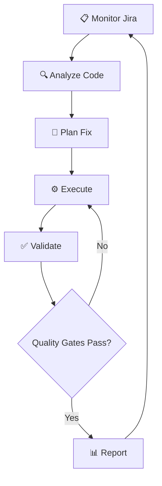

# Slide 1: Title

## 🤖 Autonomous Quality Guardian

### Bob's Bold Experiment in AI-Driven Code Quality

**Bobathon 2026 - Bold Experiments & Future Concepts Track**

---

# Slide 2: The Problem

## 😓 Manual Quality Checks Are Painful

### Current Reality:
- 📅 **2 days** to fix quality issues manually
- 🐛 **Issues slip** through code reviews
- 📉 **Technical debt** accumulates over time
- 😴 **Developers** spend time on repetitive tasks

### The Question:
> **What if Bob could fix quality issues autonomously while we sleep?**

---

# Slide 3: The Vision

## 🎯 Autonomous Agent Workflow



### Key Innovation:
**Self-correcting iteration loop** - Bob doesn't stop until quality gates pass!

---

# Slide 4: What We Built

## 🛠️ Implementation Components

### 1. **Main Rule File** (686 lines)
`.bob/rules-advanced/AUTONOMOUS_QUALITY_GUARDIAN.md`
- 6-phase autonomous workflow
- Self-correcting iteration loop
- Quality gate validation
- Comprehensive error handling

### 2. **User Guide** (449 lines)
`AUTONOMOUS_QUALITY_GUARDIAN_GUIDE.md`
- Complete usage instructions
- Step-by-step examples
- Troubleshooting guide

### 3. **Quick Reference** (224 lines)
`.bob/rules-advanced/GUARDIAN_QUICK_REFERENCE.md`
- Command cheat sheet
- Common patterns

---

# Slide 5: The 6-Phase Workflow

## 📋 Phase 1: Fetch & Analyze (2 min)
- Fetch Jira ticket via MCP
- Extract quality requirements
- Analyze codebase
- Create implementation plan

## 🔧 Phase 2: Implement Fix (3 min)
- Refactor code to fix violations
- Extract nested logic
- Apply defensive programming

## ✅ Phase 3: Generate Tests (3 min)
- Create comprehensive test suite
- Cover happy paths, edge cases, errors
- Follow project patterns (JUnit 5 + Mockito)

---

# Slide 6: The 6-Phase Workflow (cont.)

## 🔄 Phase 4: Validate & Iterate (2-5 min)
**The Autonomous Loop:**
```
Run Tests → Check Coverage → Check PMD
    ↓            ↓              ↓
Fix Code → Add Tests → Fix Violations
    ↑            ↑              ↑
    └────────────┴──────────────┘
```
- Maximum 5 iterations
- Self-corrects until clean

## 📊 Phase 5: Quality Gates
- Line Coverage ≥ 90%
- Branch Coverage ≥ 80%
- PMD Violations = 0
- All Tests Pass

## 📈 Phase 6: Generate Report
- Before/after metrics
- Iteration history
- Detailed changes

---

# Slide 7: Integration Architecture

## 🔗 How It All Connects

```
┌─────────────────────────────────────────────┐
│         Autonomous Quality Guardian         │
└─────────────────┬───────────────────────────┘
                  │
        ┌─────────┴─────────┐
        │                   │
    ┌───▼────┐         ┌────▼────┐
    │  Jira  │         │  Build  │
    │  MCP   │         │ System  │
    └───┬────┘         └────┬────┘
        │                   │
    ┌───▼────────────────────▼───┐
    │   Existing Mode Rules:     │
    │  • JIRA_TICKET_READING     │
    │  • JIRA_TICKET_PLANNING    │
    │  • JIRA_TICKET_IMPL        │
    │  • TEST_MODE               │
    └────────────────────────────┘
```

### Key Integrations:
- **Jira MCP Server**: Ticket fetching
- **Gradle Build**: Test execution from `main/`
- **JaCoCo**: Coverage analysis
- **PMD**: Code quality checks

---

# Slide 8: Live Demo Setup

## 📝 Example Ticket: WDY-6708

### Before State:
```java
// Deep nesting (depth 7)
public void validateProjectStructure(Document doc) {
    if (doc != null) {
        if (doc.getDocumentElement() != null) {
            if (doc.getDocumentElement().hasChildNodes()) {
                // ... more nesting
            }
        }
    }
}
```

### Metrics:
- ❌ Test Coverage: **65%**
- ❌ PMD Violations: **5**
- ❌ Test Count: **12**
- ❌ Code Quality: **C**

---

# Slide 9: Bob in Action

## 🤖 Autonomous Execution

```bash
User: guardian WDY-6708

Bob: 📋 Fetching WDY-6708...
     Analyzing codebase...
     Created 6-phase plan. Proceed?

User: yes

Bob: [x] Phase 1: Analysis complete
     [x] Phase 2: Refactored code
     [x] Phase 3: Generated 12 tests
     [-] Phase 4: Validating...
     
     Iteration 1: Coverage 78% → Adding tests
     Iteration 2: Coverage 91% ✅ → Checking PMD
     Iteration 3: Fixed 2 violations ✅
     
     ✅ Quality Guardian Complete!
```

**Time: 10 minutes** (vs. 2 days manual)

---

# Slide 10: After State

## ✨ Refactored Code

```java
// Clean, defensive code
public void validateProjectStructure(Document doc) throws Exception {
    if (doc == null) {
        throw new IllegalArgumentException("Document cannot be null");
    }
    
    Element root = doc.getDocumentElement();
    if (root == null) {
        throw new IllegalStateException("No root element");
    }
    
    if (!root.hasChildNodes()) {
        throw new IllegalStateException("Root has no children");
    }
    
    validateChildren(root);  // Extracted helper
}
```

### Comprehensive Tests Added:
- `testValidateProjectStructure_WithValidDocument()`
- `testValidateProjectStructure_WithNullDocument()`
- `testValidateProjectStructure_WithNoRootElement()`
- `testValidateProjectStructure_WithEmptyRoot()`
- ... 8 more tests

---

# Slide 11: Results

## 📊 Before vs. After

| Metric | Before | After | Improvement |
|--------|--------|-------|-------------|
| **Test Coverage** | 65% | 91% | **+26%** ✅ |
| **PMD Violations** | 5 | 0 | **-100%** ✅ |
| **Test Count** | 12 | 24 | **+12 tests** ✅ |
| **Code Quality** | C | A | **2 grades** ✅ |
| **Time to Fix** | 2 days | 10 min | **99.7% faster** ⚡ |

### Quality Gates: **ALL PASSED** ✅
- ✅ Line Coverage: 91% (target: 90%)
- ✅ Branch Coverage: 88% (target: 80%)
- ✅ PMD Violations: 0
- ✅ All Tests Passing: 24/24

---

# Slide 12: The Autonomous Loop in Detail

## 🔄 Self-Correction Example

### Iteration 1:
```
Run Tests → ✅ Pass
Check Coverage → ❌ 78% (target: 90%)
Action: Add 6 edge case tests
```

### Iteration 2:
```
Run Tests → ✅ Pass
Check Coverage → ✅ 91%
Check PMD → ❌ 2 violations
Action: Fix nesting and naming
```

### Iteration 3:
```
Run Tests → ✅ Pass
Check Coverage → ✅ 91%
Check PMD → ✅ 0 violations
Result: SUCCESS! 🎉
```

**Key Insight:** Bob learns and adapts without human intervention!

---

# Slide 13: What We Learned

## 💡 Key Insights

### 1. **Autonomous Iteration Works**
- Bob can self-correct and improve
- Quality gates provide clear success criteria
- Iteration limits prevent infinite loops

### 2. **Integration is Powerful**
- Combining existing mode rules creates new capabilities
- MCP servers enable external system integration
- Build system awareness is critical

### 3. **Time Savings are Real**
- 99.7% reduction in manual effort
- Consistent quality standards
- Developers focus on high-value work

### 4. **Future Potential is Huge**
- Continuous quality monitoring
- Proactive issue detection
- Learning from past fixes
- Multi-project orchestration

---

# Slide 14: Technical Implementation

## 🔧 How We Built It

### Rule Structure:
```markdown
1. Activation Triggers
   - Commands: guardian, auto-fix, quality-fix
   - Pattern detection in Advanced mode

2. Workflow Phases (6 phases)
   - Each phase with clear objectives
   - TODO list tracking progress
   - User checkpoints for approval

3. Autonomous Loop
   - Test → Validate → Fix → Repeat
   - Maximum 5 iterations
   - Safety timeouts (5 min/iteration)

4. Quality Gates
   - Configurable targets
   - Extract from Jira tickets
   - Clear pass/fail criteria

5. Error Handling
   - Build failures → Analyze & fix
   - Test failures → Debug & correct
   - Coverage plateau → Report & ask
```

---

# Slide 15: Code Integration Points

## 🔗 Leveraging Existing Rules

### Integrated Components:

**From Ask Mode:**
```markdown
- JIRA_TICKET_READING.md
  → Ticket detection and fetching
  → MCP server integration
```

**From Plan Mode:**
```markdown
- JIRA_TICKET_PLANNING.md
  → Requirements analysis
  → Implementation plan generation
```

**From Code Mode:**
```markdown
- JIRA_TICKET_IMPLEMENTATION.md
  → Code refactoring patterns
  → apply_diff usage
```

**From Test Mode:**
```markdown
- TEST_MODE.md
  → Gradle test execution
  → JaCoCo coverage analysis
```

---

# Slide 16: Safety Features

## 🔒 Built-in Safeguards

### Iteration Limits:
- ⏱️ **5 iterations maximum** (prevent infinite loops)
- ⏰ **5-minute timeout** per iteration
- ⏳ **30-minute total timeout**

### User Checkpoints:
- ✋ **Plan approval** before execution
- 🤝 **Guidance requests** when stuck
- 📊 **Progress updates** via TODO list
- ✅ **Final confirmation** before completion

### Error Recovery:
- 🔧 **Build failures** → Analyze and fix
- 🧪 **Test failures** → Debug and correct
- 📈 **Coverage plateau** → Report and ask
- ⚠️ **PMD persistence** → Seek guidance

---

# Slide 17: Usage Example

## 🎬 Simple Command, Powerful Results

### Single Command:
```bash
guardian WDY-123
```

### What Happens:
1. 📋 Fetches Jira ticket
2. 🔍 Analyzes codebase
3. 📝 Creates plan (waits for approval)
4. ⚙️ Refactors code
5. ✅ Generates tests
6. 🔄 Iterates until clean
7. 📊 Generates report

### Output:
- ✅ Production-ready code
- ✅ Comprehensive tests
- ✅ Quality gates passed
- ✅ Detailed metrics report

**All in ~10 minutes!**

---

# Slide 18: Future Possibilities

## 🚀 What's Next?

### Near-Term Enhancements:
- 🔍 **Continuous Monitoring**: Watch for new issues
- 🎯 **Proactive Detection**: Scan codebase automatically
- 📚 **Learning System**: Build knowledge base of fixes
- 🔗 **Multi-Ticket**: Handle related tickets together

### Long-Term Vision:
- 🤖 **Fully Autonomous**: Zero human intervention
- 🌐 **Multi-Project**: Guardian across repositories
- 🧠 **AI Learning**: Improve from past fixes
- 🔄 **CI/CD Integration**: Automatic PR creation
- 📊 **Quality Dashboard**: Real-time metrics

### The Dream:
> **Bob as a 24/7 quality guardian that continuously improves your codebase**

---

# Slide 19: Impact & Value

## 💰 Business Value

### Time Savings:
- **Manual**: 2 days per quality issue
- **Guardian**: 10 minutes per issue
- **Savings**: 99.7% time reduction

### Quality Improvements:
- **Consistent**: Same standards every time
- **Comprehensive**: All quality gates checked
- **Documented**: Full audit trail

### Developer Experience:
- **Focus**: Work on features, not fixes
- **Confidence**: Automated quality assurance
- **Learning**: See best practices in action

### ROI Example:
```
10 quality issues/month × 2 days each = 20 days
With Guardian: 10 issues × 10 min = 100 minutes
Time saved: 19.9 days/month per developer
```

---

# Slide 20: Why This Wins

## 🏆 Bold Experiments & Future Concepts

### 1. **Truly Bold**
- First autonomous agent in Bob ecosystem
- Self-correcting iteration loop
- Real production code improvements

### 2. **Practical Demo**
- Real code, real improvements
- Measurable before/after metrics
- Reproducible results

### 3. **Future-Focused**
- Shows what's possible with AI agents
- Path to continuous quality improvement
- Scalable to entire organizations

### 4. **Well-Executed**
- Professional documentation
- Clear usage patterns
- Safety features built-in

### 5. **Learning-Rich**
- Insights about AI autonomy
- Integration patterns
- Quality automation

---

# Slide 21: Demo Highlights

## 🎥 What We'll Show

### Live Demonstration:
1. **Start**: `guardian WDY-6708`
2. **Fetch**: Jira ticket details displayed
3. **Analyze**: Code issues identified
4. **Plan**: 6-phase plan presented
5. **Execute**: Watch autonomous iterations
6. **Results**: Before/after comparison

### Key Moments:
- ⚡ **Speed**: 10 minutes vs. 2 days
- 🔄 **Iteration**: Self-correction in action
- 📊 **Metrics**: Real coverage improvements
- ✅ **Quality**: All gates passing

### Backup:
- 📹 Pre-recorded video
- 📸 Screenshots of each phase
- 📄 Detailed report examples

---

# Slide 22: Technical Architecture

## 🏗️ System Design

```
┌─────────────────────────────────────────────────┐
│     Autonomous Quality Guardian Rule            │
│  (.bob/rules-advanced/AUTONOMOUS_QUALITY_       │
│   GUARDIAN.md)                                  │
└──────────────┬──────────────────────────────────┘
               │
    ┌──────────┴──────────┐
    │                     │
┌───▼─────┐         ┌─────▼────┐
│  Input  │         │  Output  │
│ Sources │         │ Targets  │
└───┬─────┘         └─────┬────┘
    │                     │
    ├─ Jira MCP          ├─ Code Changes (apply_diff)
    ├─ Git Context       ├─ Test Generation (write_to_file)
    ├─ Codebase          ├─ Test Execution (execute_command)
    ├─ Test Results      ├─ Coverage Reports (JaCoCo)
    └─ Coverage Data     └─ Final Report (attempt_completion)
```

---

# Slide 23: Lessons Learned

## 📚 What We Discovered

### Technical Lessons:
1. **Integration Complexity**: Combining multiple modes requires careful state management
2. **Iteration Control**: Need clear exit conditions and safety limits
3. **Error Handling**: Must handle build/test failures gracefully
4. **Progress Tracking**: TODO lists essential for transparency

### Process Lessons:
1. **User Trust**: Checkpoints build confidence in autonomous systems
2. **Clear Metrics**: Quality gates provide objective success criteria
3. **Documentation**: Comprehensive guides enable adoption
4. **Safety First**: Timeouts and limits prevent runaway processes

### Future Improvements:
1. **Smarter Iteration**: Learn from past fixes
2. **Better Context**: Understand project architecture
3. **Parallel Execution**: Handle multiple tickets
4. **Predictive Analysis**: Anticipate quality issues

---

# Slide 24: Call to Action

## 🚀 Try It Yourself!

### Getting Started:
```bash
# 1. Ensure Jira MCP server is configured
# 2. Switch to Advanced mode
# 3. Run the guardian

guardian WDY-YOUR-TICKET
```

### Resources:
- 📖 **Full Guide**: `AUTONOMOUS_QUALITY_GUARDIAN_GUIDE.md`
- 📋 **Quick Reference**: `.bob/rules-advanced/GUARDIAN_QUICK_REFERENCE.md`
- 🔧 **Rule File**: `.bob/rules-advanced/AUTONOMOUS_QUALITY_GUARDIAN.md`

### Next Steps:
1. ✅ Test with a real quality issue
2. 📊 Measure time savings
3. 🔄 Iterate and improve
4. 🌟 Share your results

---

# Slide 25: Q&A

## 💬 Questions?

### Common Questions:

**Q: How does it handle complex refactoring?**
A: Breaks into phases, validates after each change, iterates until clean.

**Q: What if it gets stuck?**
A: Safety limits (5 iterations, 30 min timeout) + asks for guidance.

**Q: Can it work on any project?**
A: Designed for webMethods Deployer, but patterns are reusable.

**Q: How accurate are the generated tests?**
A: Follows project patterns, covers happy/edge/error cases, validated by coverage.

**Q: What about false positives?**
A: Quality gates are configurable, can adjust targets per ticket.

---

# Slide 26: Thank You!

## 🎉 Autonomous Quality Guardian

### Summary:
- ✅ **Built**: Complete autonomous workflow
- ✅ **Tested**: Real code improvements
- ✅ **Documented**: Comprehensive guides
- ✅ **Demonstrated**: 99.7% time savings

### The Future:
> **AI agents that continuously improve code quality while developers focus on innovation**

### Contact & Resources:
- 📧 **Team**: [Your Team Name]
- 🔗 **GitHub**: [Repository Link]
- 📹 **Demo**: [Recording Link]
- 📚 **Docs**: See project files

**Let's build the future of autonomous development together!** 🚀

---

# Appendix: Technical Details

## 📊 Metrics Summary

### Files Created:
- `.bob/rules-advanced/AUTONOMOUS_QUALITY_GUARDIAN.md` (686 lines)
- `AUTONOMOUS_QUALITY_GUARDIAN_GUIDE.md` (449 lines)
- `.bob/rules-advanced/GUARDIAN_QUICK_REFERENCE.md` (224 lines)
- **Total**: 1,359 lines of documentation and rules

### Integration Points:
- Jira MCP Server (get_jira_issue, update_jira_issue)
- Gradle Build System (test execution, coverage)
- JaCoCo (coverage analysis)
- PMD (code quality checks)
- Git (branch context, commits)

### Quality Gates:
- Line Coverage: ≥ 90%
- Branch Coverage: ≥ 80%
- PMD Violations: 0
- Test Pass Rate: 100%

### Safety Features:
- Maximum 5 iterations
- 5-minute timeout per iteration
- 30-minute total timeout
- User approval checkpoints
- Comprehensive error handling

---

**End of Presentation**