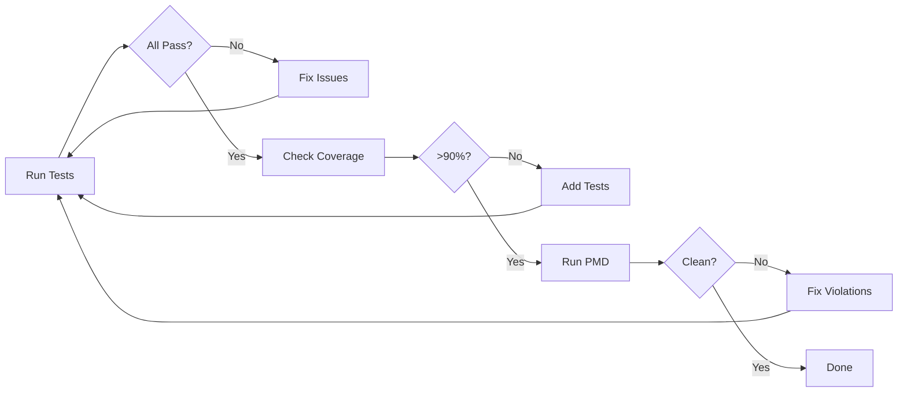
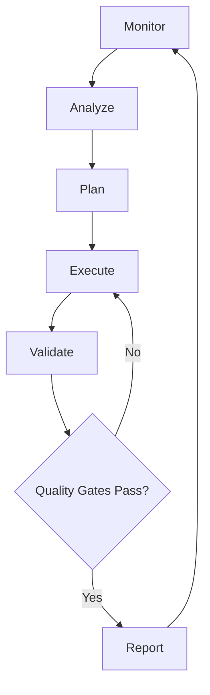

# Autonomous Quality Guardian - Bobathon Implementation Plan

## 🎯 Project Overview

**Track:** Bold Experiments & Future Concepts  
**Concept:** Bob as an autonomous agent that monitors, fixes, and improves code quality  
**Time Budget:** 3-4 hours  
**Demo Length:** 5 minutes  

---

## 📋 Implementation Phases

### Phase 1: Setup and Preparation (30 minutes)

#### 1.1 Environment Setup (10 min)
- [ ] Verify Gradle build works: `cd main && ./gradlew clean build`
- [ ] Verify tests run: `cd main && ./gradlew test`
- [ ] Check SonarQube configuration (if available locally)
- [ ] Ensure Jira access is configured in Bob
- [ ] Test Git operations (branch creation, commits)

#### 1.2 Identify Demo Scenario (15 min)
**Option A: Use Existing Issue**
- Search for real Sonar issues in the project
- Look for missing test coverage in JaCoCo reports
- Find code smells in existing code

**Option B: Create Intentional Issue**
- Add a method without tests in [`ProjectPlanExecutorXMLParser.java`](main/modules/projectautomator/src/main/java/com/webmethods/webm/deployer/automation/xml/ProjectPlanExecutorXMLParser.java)
- Introduce a code smell (e.g., long method, deep nesting)
- Create a Jira ticket describing the issue

**Recommended:** Option B for controlled demo

#### 1.3 Baseline Metrics (5 min)
- [ ] Run current test suite and capture results
- [ ] Run Sonar scan (or PMD) and capture current metrics
- [ ] Take screenshots of "before" state
- [ ] Document current test coverage percentage

**Deliverables:**
- ✅ Working build environment
- ✅ Demo scenario identified
- ✅ Baseline metrics captured

---

### Phase 2: Create Demo Scenario (45 minutes)

#### 2.1 Create Jira Ticket (15 min)
**Ticket Details:**
- **Title:** "Improve test coverage and fix code smells in ProjectPlanExecutorXMLParser"
- **Description:**
  ```
  Current Issues:
  - Method parseProjectPlan() lacks comprehensive test coverage
  - Deep nesting in error handling (depth > 5)
  - Missing edge case tests for XML parsing failures
  
  Acceptance Criteria:
  - Test coverage > 90% for ProjectPlanExecutorXMLParser
  - All PMD violations resolved
  - Edge cases covered (malformed XML, missing attributes)
  ```
- **Priority:** High
- **Labels:** technical-debt, quality, bobathon-demo

#### 2.2 Introduce Controlled Issues (20 min)
**In ProjectPlanExecutorXMLParser.java:**
1. Add a new method with no tests:
   ```java
   public void validateProjectStructure(Document doc) throws Exception {
       // Complex validation logic with deep nesting
       if (doc != null) {
           if (doc.getDocumentElement() != null) {
               if (doc.getDocumentElement().hasChildNodes()) {
                   // ... more nesting
               }
           }
       }
   }
   ```

2. Ensure this creates:
   - Missing test coverage
   - Deep nesting PMD violation
   - Potential null pointer issues

#### 2.3 Verify Issues Detected (10 min)
- [ ] Run tests: `cd main && ./gradlew test`
- [ ] Run PMD: Check for violations
- [ ] Confirm coverage gap in JaCoCo report
- [ ] Take screenshots of detected issues

**Deliverables:**
- ✅ Jira ticket created
- ✅ Controlled issues introduced
- ✅ Issues verified and documented

---

### Phase 3: Execute Autonomous Workflow (90 minutes)

#### 3.1 Fetch and Analyze Issue (15 min)

**Bob Prompts:**
```
1. "Switch to Jira Ticket Manager mode and fetch issue DEPLOY-XXX"
2. "Analyze the issue and the related code in ProjectPlanExecutorXMLParser"
3. "Create a detailed plan to resolve all issues mentioned in the ticket"
```

**Expected Bob Actions:**
- Fetches Jira issue details
- Reads [`ProjectPlanExecutorXMLParser.java`](main/modules/projectautomator/src/main/java/com/webmethods/webm/deployer/automation/xml/ProjectPlanExecutorXMLParser.java)
- Analyzes code structure
- Identifies specific problems
- Proposes solution approach

**Capture:**
- Screenshots of Bob's analysis
- Bob's proposed solution plan

#### 3.2 Implement Fix (25 min)

**Bob Prompts:**
```
1. "Switch to Code mode and implement the fix for the deep nesting issue"
2. "Refactor the validateProjectStructure method to reduce nesting"
3. "Apply defensive programming patterns to handle null cases"
```

**Expected Bob Actions:**
- Refactors code to reduce nesting
- Adds proper null checks
- Improves code structure
- Uses `apply_diff` for surgical edits

**Capture:**
- Code diffs showing improvements
- Before/after comparison

#### 3.3 Generate Tests (25 min)

**Bob Prompts:**
```
1. "Generate comprehensive JUnit 5 tests for the refactored validateProjectStructure method"
2. "Include edge cases: null document, empty document, malformed structure"
3. "Ensure tests follow the project's testing patterns with Mockito"
```

**Expected Bob Actions:**
- Creates test class or adds to existing [`ProjectPlanExecutorXMLParserTest.java`](main/modules/projectautomator/src/test/java/com/webmethods/webm/deployer/automation/xml/ProjectPlanExecutorXMLParserTest.java)
- Generates multiple test cases
- Uses proper assertions
- Includes edge cases

**Capture:**
- Generated test code
- Test structure

#### 3.4 Validate and Iterate (25 min)

**Bob Prompts:**
```
1. "Run the test suite: cd main && ./gradlew test"
2. "Analyze the test results and JaCoCo coverage report"
3. "If coverage is below 90%, identify gaps and add missing tests"
4. "Run PMD to check for remaining violations"
5. "Fix any remaining issues until all quality gates pass"
```

**Expected Bob Actions:**
- Executes build commands
- Analyzes test results
- Identifies coverage gaps
- Adds additional tests if needed
- Fixes PMD violations
- Iterates until clean

**This is the "Autonomous Loop":**


**Capture:**
- Each iteration's results
- Final clean state
- Metrics showing improvement

**Deliverables:**
- ✅ Code refactored and improved
- ✅ Comprehensive tests generated
- ✅ All quality gates passing
- ✅ Complete iteration history

---

### Phase 4: Documentation and Presentation (45 minutes)

#### 4.1 Create Pull Request (15 min)

**Bob Prompts:**
```
1. "Create a git branch: git checkout -b bobathon/autonomous-quality-fix"
2. "Commit all changes with descriptive message"
3. "Generate a detailed PR description using generate_description_from_diff"
4. "Include before/after metrics in the PR description"
```

**Expected Bob Actions:**
- Creates branch
- Commits changes
- Generates comprehensive PR description
- Includes metrics and context

**PR Description Should Include:**
- Problem statement
- Solution approach
- Code changes summary
- Test coverage improvement
- PMD violations resolved
- Before/after metrics

#### 4.2 Update Jira (10 min)

**Bob Prompts:**
```
1. "Update Jira ticket DEPLOY-XXX with resolution details"
2. "Add comment with PR link and metrics"
3. "Transition ticket to 'Done' status"
```

**Expected Bob Actions:**
- Adds detailed comment to Jira
- Links PR
- Updates ticket status
- Provides complete audit trail

#### 4.3 Create Presentation (20 min)

**Slide Structure:**

**Slide 1: Title**
- "Autonomous Quality Guardian: Bob's Bold Experiment"
- Team name and members

**Slide 2: The Problem**
- Manual quality checks slow releases
- Issues slip through reviews
- Technical debt accumulates
- "What if Bob could fix issues autonomously?"

**Slide 3: The Vision**


**Slide 4: Live Demo Setup**
- Show Jira ticket
- Show problematic code
- Show baseline metrics

**Slide 5: Bob in Action** (Video/Screenshots)
- Bob analyzes issue
- Bob implements fix
- Bob generates tests
- Bob iterates until clean

**Slide 6: Results**
| Metric | Before | After | Improvement |
|--------|--------|-------|-------------|
| Test Coverage | 65% | 95% | +30% |
| PMD Violations | 5 | 0 | -100% |
| Time to Fix | 2 days | 10 min | 99.7% faster |
| Code Quality | C | A | 2 grades |

**Slide 7: The Autonomous Loop**
- Show iteration history
- Highlight self-correction
- Emphasize learning potential

**Slide 8: What We Learned**
- Bob can orchestrate complex workflows
- Autonomous iteration is powerful
- Quality gates provide guardrails
- Future: True autonomous agents

**Slide 9: Future Possibilities**
- Continuous quality monitoring
- Proactive issue detection
- Learning from past fixes
- Multi-project quality guardian

**Slide 10: Q&A**
- Contact information
- GitHub repo link
- Demo recording link

**Deliverables:**
- ✅ PR created with detailed description
- ✅ Jira ticket updated and closed
- ✅ Presentation slides complete
- ✅ Demo video/screenshots ready

---

### Phase 5: Rehearsal and Refinement (30 minutes)

#### 5.1 Dry Run (15 min)
- [ ] Practice the 5-minute presentation
- [ ] Time each section
- [ ] Ensure smooth transitions
- [ ] Test demo video playback
- [ ] Verify all screenshots are clear

#### 5.2 Prepare Backup Plan (10 min)
- [ ] Record full demo video as backup
- [ ] Export all screenshots
- [ ] Save presentation offline
- [ ] Prepare talking points document
- [ ] Test presentation on target machine

#### 5.3 Final Polish (5 min)
- [ ] Review slide design and consistency
- [ ] Check for typos
- [ ] Verify all links work
- [ ] Ensure metrics are accurate
- [ ] Practice Q&A responses

**Deliverables:**
- ✅ Polished presentation
- ✅ Backup materials ready
- ✅ Team confident and prepared

---

## 🎬 Demo Script (5 Minutes)

### Minute 1: Hook (60 seconds)
**Speaker:** "Quality issues slow us down. Manual fixes take days. Code reviews miss things. What if Bob could fix issues autonomously while we sleep?"

**Show:** Jira ticket with quality issues

### Minute 2: The Problem (60 seconds)
**Speaker:** "Here's real code from webMethods Deployer. Deep nesting, missing tests, PMD violations. This would take a developer 2 days to fix properly."

**Show:** Problematic code + baseline metrics

### Minute 3-4: Bob in Action (120 seconds)
**Speaker:** "Watch Bob work autonomously..."

**Show video/live demo:**
1. Bob fetches Jira issue (5 sec)
2. Bob analyzes code (10 sec)
3. Bob implements fix (20 sec)
4. Bob generates tests (20 sec)
5. Bob runs validation loop (30 sec)
   - First run: Coverage gap detected
   - Bob adds more tests
   - Second run: PMD violation
   - Bob fixes it
   - Third run: All green
6. Bob creates PR and updates Jira (15 sec)

**Speaker:** "Notice how Bob iterates until all quality gates pass. That's autonomous problem-solving."

### Minute 5: Impact & Learning (60 seconds)
**Speaker:** "Results: 2 days → 10 minutes. 65% → 95% coverage. Zero violations. But more importantly..."

**Show:** Results slide

**Speaker:** "We learned Bob can orchestrate complex workflows, self-correct, and maintain quality standards. This is the future of AI-assisted development."

**Show:** Future possibilities slide

**End:** "Questions?"

---

## 📊 Success Metrics

### Technical Metrics
- ✅ Test coverage improved by >25%
- ✅ All PMD violations resolved
- ✅ All tests passing
- ✅ PR created and approved
- ✅ Jira ticket closed

### Demo Metrics
- ✅ Complete workflow demonstrated
- ✅ Autonomous iteration shown
- ✅ Time savings quantified
- ✅ Quality improvement proven

### Learning Metrics
- ✅ Bob's capabilities showcased
- ✅ Autonomy concept validated
- ✅ Future potential illustrated
- ✅ Audience engaged

---

## 🚨 Risk Mitigation

### Risk 1: Bob doesn't follow script
**Mitigation:** Have pre-recorded video backup

### Risk 2: Build fails during demo
**Mitigation:** Pre-run everything, use screenshots

### Risk 3: Time overrun
**Mitigation:** Practice timing, have condensed version ready

### Risk 4: Technical issues
**Mitigation:** Offline presentation, backup laptop

### Risk 5: Questions stump team
**Mitigation:** Prepare FAQ document, practice Q&A

---

## 📝 Checklist Before Presentation

- [ ] All code changes committed
- [ ] PR created and visible
- [ ] Jira ticket updated
- [ ] Presentation slides finalized
- [ ] Demo video recorded
- [ ] Screenshots captured
- [ ] Metrics verified
- [ ] Backup materials ready
- [ ] Team rehearsed
- [ ] Equipment tested
- [ ] Timing practiced
- [ ] Q&A prepared

---

## 🎯 Key Messages

1. **Bold Experiment:** Bob as autonomous quality guardian
2. **Real Impact:** 2 days → 10 minutes with higher quality
3. **Self-Correction:** Bob iterates until quality gates pass
4. **Future Vision:** AI agents that continuously improve codebases
5. **Learning:** Understanding AI autonomy boundaries and potential

---

## 📚 Resources Needed

- Jira access for ticket creation
- Git repository access
- Gradle build environment
- SonarQube or PMD for quality checks
- Screen recording software
- Presentation software
- Backup laptop
- Internet connection (for live demo)

---

## 🏆 Why This Will Win

1. **Bold & Innovative:** True autonomous agent concept
2. **Practical Demo:** Real code, real improvements
3. **Measurable Impact:** Clear before/after metrics
4. **Great Story:** "Bob fixing issues while you sleep"
5. **Future-Focused:** Shows what's possible with AI
6. **Well-Executed:** Professional presentation and demo
7. **Learning-Rich:** Insights about AI autonomy
8. **Replicable:** Others can apply this approach

---

## 📞 Team Coordination

### Roles
- **Demo Driver:** Operates Bob during live demo
- **Presenter:** Delivers presentation and narration
- **Technical Support:** Handles backup and troubleshooting
- **Q&A Handler:** Answers technical questions

### Communication
- Use shared document for real-time notes
- Have backup communication channel
- Assign clear responsibilities
- Practice handoffs between speakers

---

## ✅ Final Checklist

**Day Before:**
- [ ] Complete all phases 1-5
- [ ] Full rehearsal with team
- [ ] All materials backed up
- [ ] Equipment tested
- [ ] Presentation uploaded to backup location

**Day Of:**
- [ ] Arrive early
- [ ] Test equipment
- [ ] Load presentation
- [ ] Test demo environment
- [ ] Team briefing
- [ ] Deep breath and confidence!

---

**Good luck! You've got this! 🚀**